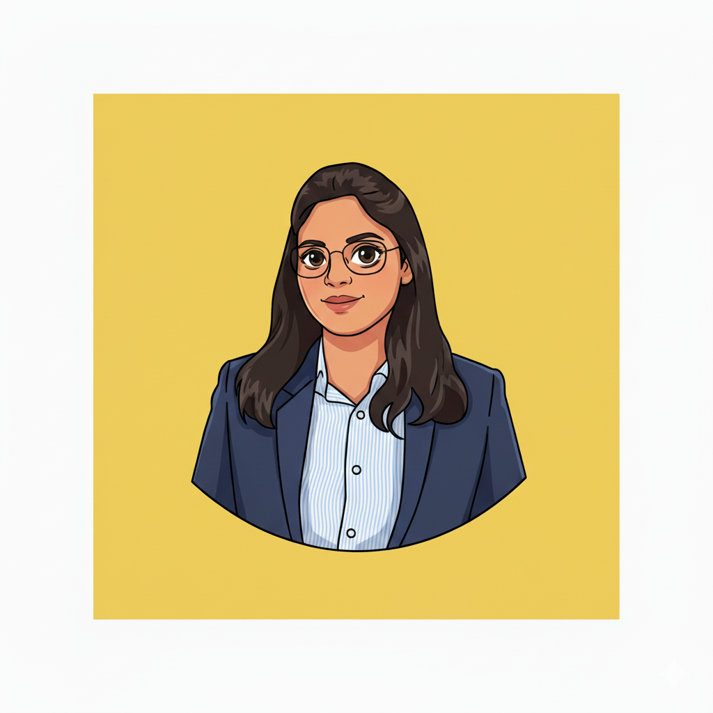

# Shrijya Patil Portfolio 👩🏽‍🚀

Hi! I'm Shrijya Patil, a student at *D.Y. Patil College of Engineering and Technology, Kolhapur*.  
This is my personal portfolio built with *ReactJS*, showcasing my skills, projects, articles, and achievements.  

---

## 📸 Me

<p align="center">
  
</p>


---

## 💻 Live Demo

Check out my live portfolio here:  
🌐 [https://shrijya.github.io/reactfolio](https://shrijya.github.io/reactfolio)

---

## 🌟 Features

- 📄 Multi-page layout: Home, About, Projects, Articles, Contact  
- 📱 Fully responsive design for mobile, tablet, and desktop  
- 🛠 Easily customizable components  
- 🖼 Showcase your work, projects, and skills professionally  

---

## 🚀 Installation

Clone this repository and install dependencies:

```bash
git clone https://github.com/Shrijya/reactfolio.git
cd reactfolio
npm install
npm start


📂 Project Structure

/public – Static files (images, favicon, etc.)

/src – React components and pages

/components – Reusable components for each page

/pages – Main pages like Home, About, Projects, Articles, Contact

/data – Configuration files (user info, SEO, articles, tracking)


⚙ Configurations

You can edit the portfolio data easily in /src/data/:

user.js – Your personal info, skills, and social links

articles.js – Add your articles and blog posts

styles.css – Change fonts, colors, and themes

tracking.js – Add Google Analytics ID if needed

🏗 Build & Deploy
To create a production build:

    npm run build


📫 Contact Me

✉ Email: shrijyapatil158@gmail.com

💼 LinkedIn: www.linkedin.com/in/shrijya-patil-0a6349248

🐱 GitHub: Shrijya


If you have any suggestions on what to improve in Reactfolio and would like to share them, feel free to leave an issue or fork project to implement your own ideas
